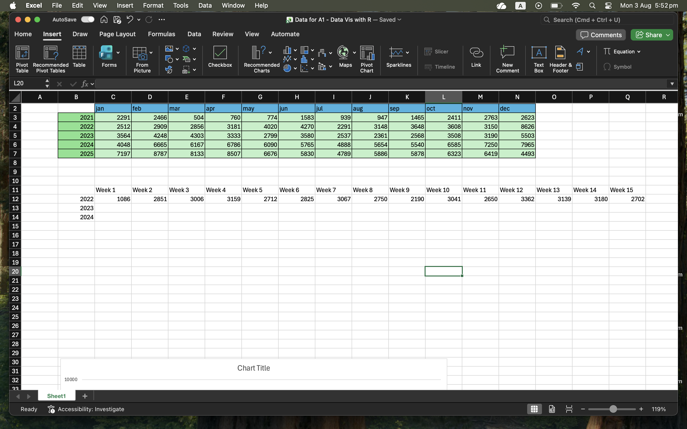
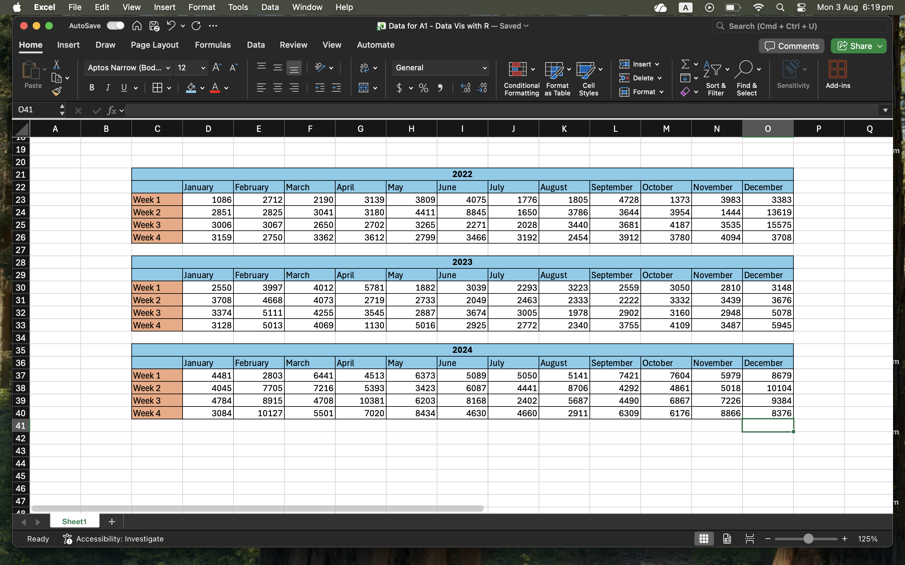
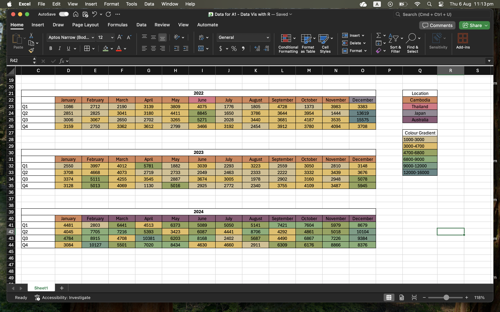

# Module 1: Part II- Draw it like Playfair, Minard and Nightingale
*Published 7 August 2026*

## The Data

This data for this project was collected from the Health app on my Iphone which captured my daily steps dating all the way back to high school before Icame to Australia. I chose this 
data because I've realised my walking habits have changed a lot depending on where I am, and  I wanted to visualise the years of walking data to see how exactly much has changed and
find patterns and insights on which periods I tend to walk more or walk less. 

## The process

During this stage, I was collecting data by hand and writing it down in excel through creating columns and tables. I was still unsure of how to proceed, initially I thought of capturing the 
monthly average steps over the last 5 years and visualising it via a line plot with each line representing a year, but I thought it was too simple. I challenged myself a little and realised
a heatmap would be a fun way of visualising walking; I ultimately went with creating a calendar heatmap as my final choice of visualisation.

 

I drafted the initial heatmap into a horizontal table and chose 3 years (2022-2024) as I believethey contained the most interesting data as that was when I went on a few overseas trips and in 2024
Im oved to Australia for university. This would be a good opportunity to see how my walking habits would've changed when I moved cities.

I went to Kmart to buy coloured pencils and chose a pastel set as they have a good range of gradients that would be cool to see in my hand drawn version. 

 

I used the colours of the pastel pencils to inspire the colour scale and shaded each cell accordingly. Additionally, I coloured each month of each year to highlight which location I was in during each period. 

 

Once I got everything planned out, I started to draw the heatmap by hand on the piece of graphing paper which was kindly given to me by our course coordinator Dr. James Baglin. 

## The final visualisation

This is the final version, I tried my best--not bad for someone who hasn't touched art since 10th grade. 

## Personal Reflection

Creating a data visualisation from scratch wasn't an easy job, I bounced around many different ideas until I found one which excited me. I wanted to do a personal visualisation 
because I wanted to challenge myself and now that I've finished it, I feel pretty satisfied with the result. This didn't come with challenges though, firstly in the final visualisation 
the first year's table looks a bit of a mess because I drew the grid lines with pencil before shading in with the pastel coloured pencils, which left a murky effect as the two didn't mix 
very well. For the next two year's table, I shaded the cells first before adding in the lines and visually it looked a lot neater, the gradient can be seen more clearly and the heatmap
was overall a success despite a new trials and error along the way. 

THe calendar heatmap showed that my walking habits have changed a lot since I moved to Australia. My home country Cambodia didn't have a lot of walkable  infrastructure, most people commute by tuktuk, 
motorbikes or cars every day, even for short trips. Our roads aren't made to accomodate walking except for a few parks or in certain neighborhoods where roads were bigger. This is reflected in my 2022 
and 2023 heatmap where most of my weekly averages were between 2500-3000 steps. There were some outliers though, such as in December of 2022 where I went on a trip to Japan with highschool friends, 
during that 2 week period we traveled to Tokyo, Osaka, Kyoto and Gunma, unlike Cambodia, walking is very common in  Japan as their infrastructure supported it, this is reflected in my steps count where 
I averaged 13619 and 15575. 2023 remained largely the same as it was my final year of high school in Cambodia. The change can be seen starting February of 2024 where I moved to Australia for my first year, 
living in Melbourne's CBD, the walking infrastructure is amazing, it is very easy to get from one place to another via walking and it became a daily habit to walk everywhere whether its for Uni, groceries, 
going out with friends or just sightseeing. My weekly averages made a huge leap to 5000+ steps daily, almost doubled from when I was in Cambodia. Despite me not traveling, there were even weeks here where 
I averaged 10,000+ steps. Additionally, I've noticed that my average steps in the summer months is a lot higher than the winter months in Australia, which indicates that I enjoy warmer weather a lot more 
and tend to go outside more often during warm weather--which is a reflection my upbringing growing up in a tropical humid country where its constantly hot 365 days of the year. 

This task has helped me develop my data synthesis skills and visualisation skills by teaching me how to transform a large amount of raw data into a visual format that communicates a clear story.
Throughout the weeks, I used microsoft Excel to organise and calculate my daily and weekly step data before translating it into a hand-drawn calendar heatmap. Instead of simply showing the numbers, 
I thought carefully about how viewers would interpret the information and which visual elements to maximise pattern noticeable. The concepts we learnt in week 2 about perception and 
pre-attentive processing informed my design decisions. I specifically chose heatmap calendar layput with a colour gradient to highlight differences in walking activity to leverage the Gestalt principle; 
putting data points close together so viewers naturally group them into familiar weekly/monthly structures. The colour gradient was used to highlight the principle of similarity, which enabled viewers to 
instantly group weeks with identical colour intensities, making the trends and patterns with walking more noticeable. Additionally, I was also ware of the limitations of colour alone, as we discussed with 
Cleveland and McGill's work on visual comparison, I made sure the heatmap was supported by a clear legend and organised structure to make the information easier to interpret. Overall, this project has given 
me a much greater appreciation for the great minds of our past who've created beautiful and sophisticated visualisations by hand. It made me realise how much planning and thought is needed behind each visualisation.
I believe the skills that I developed in data-synthesis, visual communication and audience-centred design thinking will be valuable for future academic projects, presentations and in my professional work where 
communicating complex information in a digestable manner is essential. 

