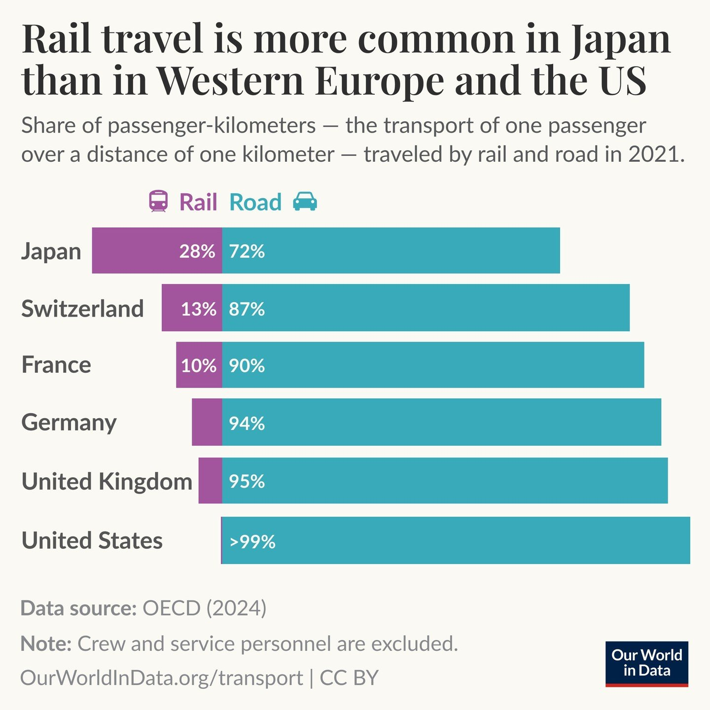

# Module 2: Gestalt

*Published 7 August 2026*

## Objective

This module tasks me with choosing an visualisation and analysing it through answering a variety of questions that discusses design choices and data visualisation theory. 
I chose the visualisation titled "Rail travel is more common in Japan than in Western Europe and the US" which was found on the website Ourworldindata.org. 

## The visualisation

*Source: [Samborska & Acisu (2024)](#references)*

## What first grabbed my attention: preattentive processing

The visualisation highlights that rail travel is a more common mode of transport in Japan compared to the western world. What stood out to me about this visualisation was the use of colours against 
a blank backdrop that immediately grabbed my attention. The use of icons such as the purple train and aqua car which corresponds to the horizontal bars (while technically not a pre-attentive element) 
intuitively tells me how to interpret the visualisation without me needing to see the figures.  The design choices are deliberate and follows the principles of pre-attentive processing such as colours, 
position and length. Colours were the most important distinction as it immediately grabs viewers’ attention, the positioning of the countries next to the horizontal bars informs the viewer which bar 
represents which country, and length is used in the horizontal bars splitting to visually represent the percentage difference of rail compared to road, overall, all of these choices contribute to making 
the figures easily digestible for the viewer.  

## Gestalt law demonstrated

One Gestalt law that this visualisation effectively demonstrates is Similarity, the viewer can immediately group the elements based on shared colour, with purple always representing rail and aqua always
representing road. Since each rail segment uses the same colour, the brain automatically groups them as belonging to the same category across all six countries, vice versa for aqua and road. This allows
the viewer to contextualise the entire visualisation immediately without having to consciously read the legend every time.

## Visual comparison accuracy

A key quantitative variable presented in this visualisation is the percentage of passenger-kilometres travelled by rail. The visual accuracy is correct because it uses a bar length, which is one of the 
most effective visual encodings for comparing quantitative values. According to Cleveland and McGill (1984), position along a common scale and length are among the most accurate visual encodings for 
quantitative data. Since all bars having a beginning from a common baseline, the viewer can easily and accurately compare between countries, and the numerical labels further solidifies that which reducing 
the need for estimating the values visually. Additionally, the stacked bars show a complete 100% split between rail and road travel, making the proportions clear and concise to interpret. However, a critique 
of this visualisation is for countries such as Germany, UK and USA  with small rail segments, they are much harder to compare precisely by length alone, meaning viewers are reliant on the numerical labels to 
accurately estimate the exact value. 

## References

Samborska, V., & Acisu, T. (2024, September 6). Rail travel is more prevalent in Japan than in Western Europe, and much more than in the United States. Our World in Data. 
https://ourworldindata.org/data-insights/rail-travel-is-more-prevalent-in-japan-than-in-western-europe-and-much-more-than-in-the-united-states

