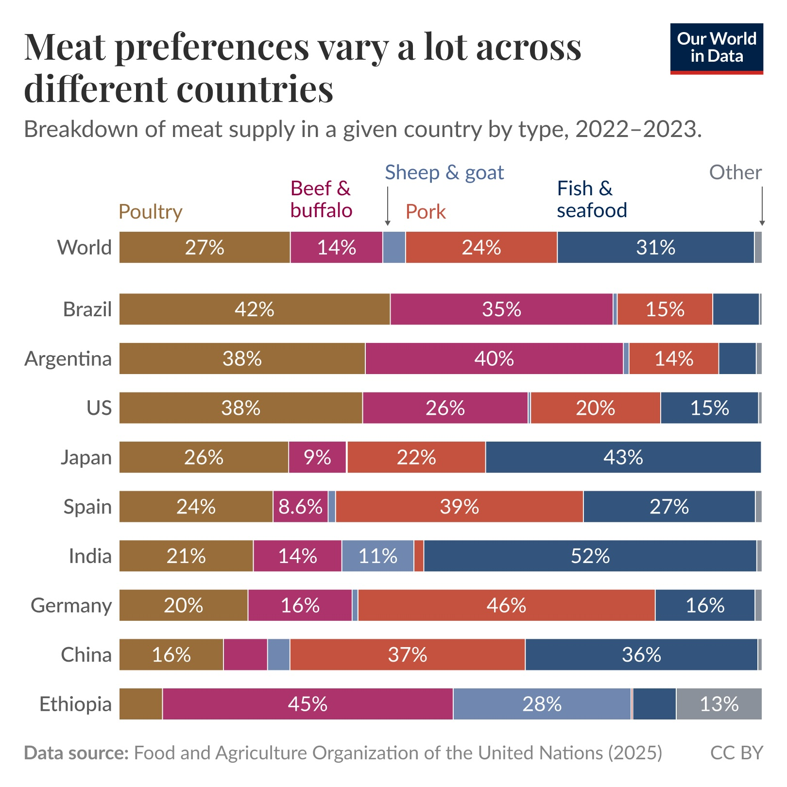
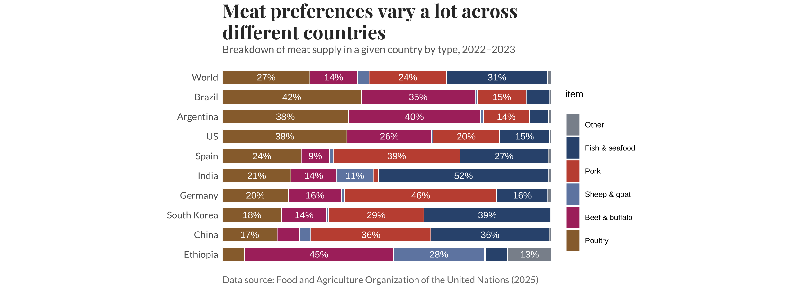
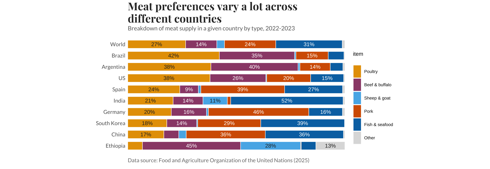

# Module 5: Copy the master & recolour it!

*Published 28 August 2026*

## Chosen Master Visualisation

Ritchie, H., & Arriagada, P. (2026, August 25). Meat preferences vary a lot across different countries. Our World in Data. https://ourworldindata.org/data,insights/meat,preferences,vary,a,lot,across,different,countries 

## Summarising the selection 
For this task, I selected the Our World in Data (OWID) visualisation titled Meat preferences vary a lot across different countries, created by Hannah Ritchie and Pablo Arriagada. I chose this visualisation because I found the way it communicates differences in meat preferences between countries particularly effective and visually appealing.  

Rather than comparing the absolute amount of meat consumed, the visualisation shows the percentage composition of meat supply within each country. This makes it easy to see how the dominant types of meat vary between countries. For example, the original visualisation highlights differences such as chicken being particularly prominent in the United States, beef in Argentina, and fish and seafood in India. The authors also explain that the chart focuses on relative quantities within national diets rather than the total amount of meat consumed. 

## Creation process

I rebuilt the chart in R using ggplot2. To match the original as closely as possible, I used a colour picker, specifically Figma's colour picker, on the published image to sample the colours for each meat category rather than guessing at similar colours. This gave me the palette used in the original: 

Poultry #986D3A · Beef & buffalo #AD336C · Sheep & goat #7087B0 · Pork #C5523F · Fish & seafood #33547D · Other #8A919B 

Several things went wrong before the reproduction looked right, and working through them taught me more than the parts that worked first time. Segment order. My first attempt did not have the meat categories in the same order as the original. I fixed this by explicitly converting the meat type column to a factor and setting the level order myself. This allowed me to control the order in which the segments appeared in the stacked bars. 

Label clutter. Adding geom_text put a percentage on every single segment, including very small sections, which made some of the bars harder to read. I solved this with an ifelse inside the label aesthetic so that only segments of eight percent or more are labelled, while anything below eight percent is returned as an empty string. 

Label position. By default, the labels did not sit in the centre of their respective segments. Adding position_stack(vjust = 0.5) centred each label within its own section of the stacked bar, making the labels easier to read. 

Fonts. The original uses a serif face for the title and a sans-serif font for the other text, so I used Playfair Display for the title and Lato for the country labels, subtitle and caption. I registered the fonts using font_add_google() and enabled them with showtext_auto() so that R could use them when rendering the graph. 

Bar padding. There was extra space at the ends of the continuous x-axis, which made the bars appear slightly separated from the edges of the plotting area. I used expand = expansion(mult = c(0, 0)) to remove this padding and make the layout closer to the original. 

Title spacing. The gap between the title and subtitle was wider than the original. I used a negative bottom margin on the title to pull the subtitle closer. Although this is more of a visual adjustment than a technical requirement, it gave me a closer match to the original layout. 

I then removed the axis furniture and gridlines with theme_minimal() and a series of element_blank() calls. This removed the x-axis text, ticks, gridlines and axis titles, leaving the percentages inside the bars to provide the quantitative information. I saved both an intermediate test version and the finished reproduction as image files before moving on to the recolouring. 

# My Recreation of the OWID Chart

## Reconstructing with an alternative colour-scale 

For my first reproduction, I used the colours sampled directly from the original visualisation. I then considered how the palette would work for readers with colour vision deficiency. The original palette contains several warm colours with similar visual characteristics, particularly the brown, magenta and red used for some of the larger meat categories. Although the colours were distinguishable to me under normal vision, I did not want accessibility to depend only on how the chart appeared to me. 

I therefore switched to an alternative palette based on the Okabe-Ito colour palette, which is widely used for colour-universal design because its colours were selected to remain distinguishable for people with different forms of colour vision deficiency. Rather than using the palette completely unchanged, I adapted it to better suit the visualisation. I used orange for Poultry, a darker reddish-purple for Beef & buffalo, sky blue for Sheep & goat, vermillion for Pork, blue for Fish & seafood, and light grey for Other. 

The final palette I used was: 

Poultry #E69F00 · Beef & buffalo #9B4B77 · Sheep & goat #56B4E9 · Pork #D55E00 · Fish & seafood #0072B2 · Other #DDDDDD 

I specifically darkened the purple used for Beef & buffalo and lightened the grey used for Other. This helped keep the colours visually separated while also making "Other" less visually dominant because it represents a residual category rather than a specific meat type. 

Changing the colours introduced another issue with the percentage labels. In the original chart, all of the labels were white. This worked reasonably well against the darker fills, but the lighter orange, blue and grey backgrounds were not suitable for white text. I therefore made the text colour conditional on the fill colour. 

I created a vector called light_fills containing Poultry, Sheep & goat and Other. These three categories use dark grey text, while the remaining categories continue to use white text. I placed the colour selection inside the aes() function and used scale_colour_identity() so that ggplot uses the specified text colours directly. 

I kept the same eight-percent threshold for the labels, meaning that only segments at or above eight percent receive percentage labels. This reduces visual clutter while still displaying the values of the larger sections. I also kept the labels centred within their segments using position_stack(vjust = 0.5). 

Finally, I reversed the legend using guide_legend(reverse = TRUE) so that its order matches the order in which the meat categories appear in the stacked bars. The result is a recoloured version that keeps the structure and layout of the reproduced visualisation while improving the distinction between categories and the readability of labels on lighter backgrounds. 

# My Recolour of the OWID chart

