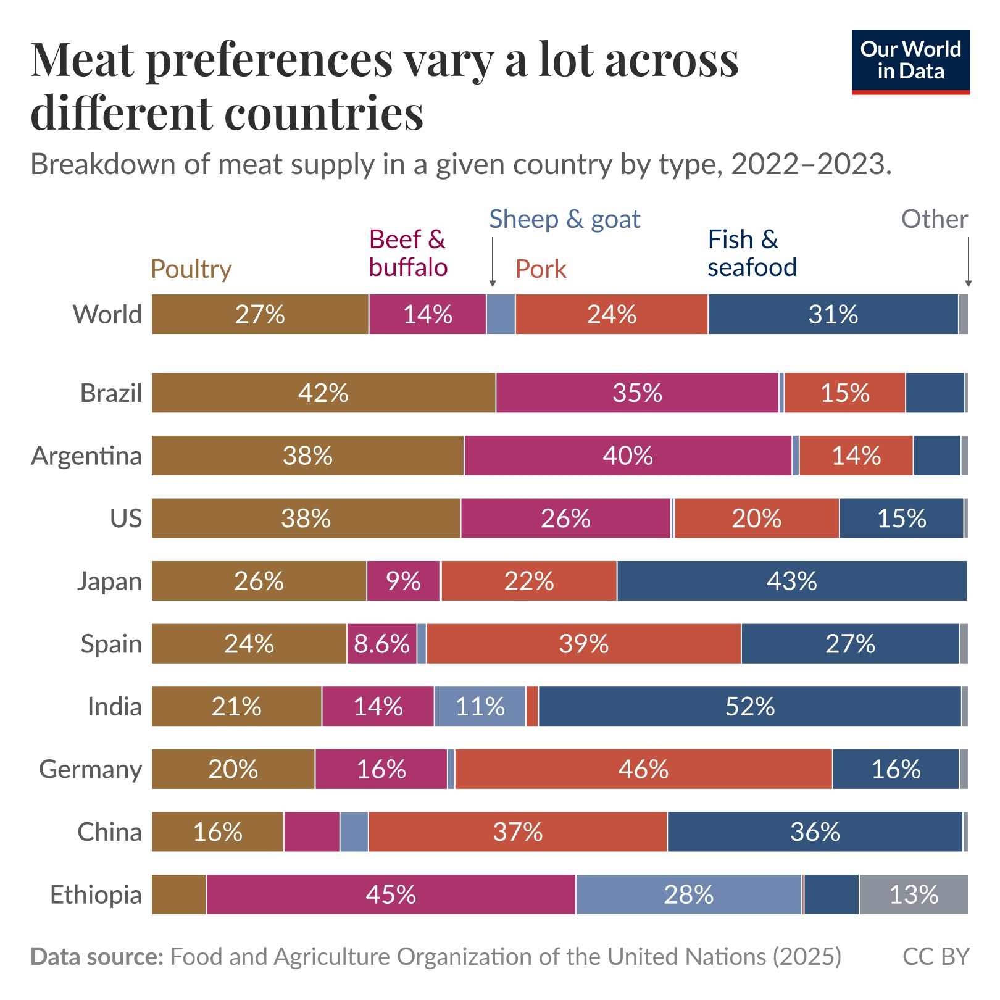
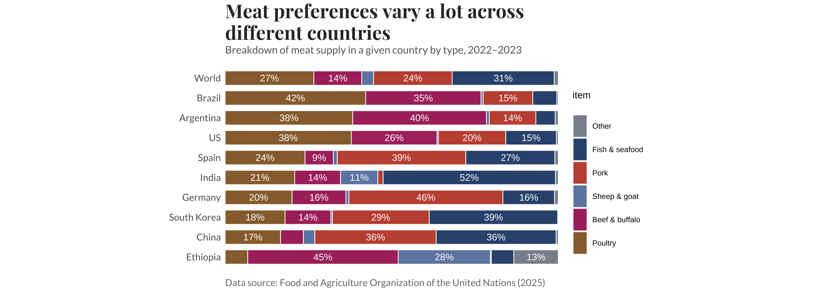
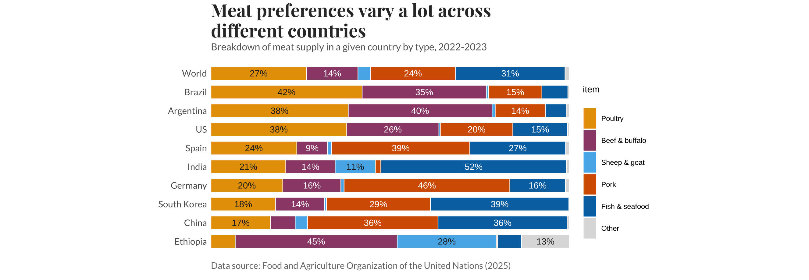

# Module 6: Finding Improvements and Making It

*Published 2 October 2026*

## Current Visusalisation

Ritchie, H., & Arriagada, P. (2026, August 25). Meat preferences vary a lot across different countries. Our World in Data. https://ourworldindata.org/data,insights/meat,preferences,vary,a,lot,across,different,countries 

## 1. Examining the data visualisation for accessibility issues and identify at least one improvement that I can make.
I noticed that this chart doesn't really convey a concise or intentional message to the viewer, it serves a summary of findings; basically telling the viewer "hey look at this" but doesn't really answer "why you should  care". I need to make the message more clear. Aside from that, there are also small accessibility issues because the legend on the right is labeled bottom to top from Poultry while the stacked bar chart is labeled left to right from Poultry, this creates a minor inconvenience for the audience to have to look pack and forth to try and match the legend's colour to the meat category. There's gotta be a more convenient way to approach this. 

## 2. Running my data visualisation through the Data Visualization Checklist and identifing improvement(s) that to be made. 

Upon assessing the Data Visualisations Checklist, I scored 44/46 (95.7%), the only item I marked as Not Met was legibility when printed on black and white. On second review, I realised my self-grading was generous. Several items marked as Fully Met was closer to Partially Met: 

Using colour to highlight patterns: All six categories had equally strong colours, so colour separated the categories rather than emphasising anything. 

Highlighting a finding: The title described variation in general rather than stating a specific conclusion. 

Intentional ordering: The countries were sorted by poultry share, but the chart never told the reader that. 

Direct labelling: The percentages were labelled on the bars, but the meat categories relied on a separate legend. 

This meant that a more realistic score was around 40/46 (~86%), while thats still above the 85% threshold deemed to be a “competent visualisation”, it was clear that there were areas I can work upon to improve accessibility and message clarity. 

## 3. Summary of planned improvements: 
After reviewing my chart against the Data Visualisation Checklist, I identified accessibility as a main area of concern and improvement. My current charts rely heavily on colour, and while the recoloured version is more colour-blind friendly, it is still very hard to interpret if printed in black and white, potentially causing issues for viewers who can’t discern the meat categories off of colour alone. To address this, I plan to label each category directly on the stacked bar chart and removing the legend. I will also change white labels on light segments to dark text to improve contrast and visual clarity for viewers. Beyond accessibility, I want the chart to communicate a clearer message, I plan to rewrite the title to state a specific finding, use colour to emphasise the category that supports that finding and either sort the countries by a key category or explain the current ordering in the subtitle. Finally, I will add alt text, so the chart is accessible to screen reader users.  

## Reconstructing the data visualisation with improvements made

Recreating the data visualisations but with my stated improvements:
 

## Greyscale version to check the "printed in black and white" checklist item, done using the installed R package “magick” to make the visualisation appear black and white: 

## Reflection

I started by recreating the “meat preferences vary a lot across different countries” chart in R using FAO data. It’s a 100% stacked bar chart showing each meat type’s share of total supply for the world and nine countries. Then I recoloured it following Okabe-Ito's approach to adhere to responsible colour-usage principles, both were done in Module 5 exercise and displayed on my GitHub portfolio already.  

 

In my final revision, I used the summary of planned improvements I wrote above as a guide and anchor to how I approached the improve visualisation. I focused on making the visualisation more accessible while also strengthening its overall message. I removed the legend and placed category labels on the chart, using cumsum() to calculate the midpoint of each segment. This made the chart easier to interpret without requiring readers to repeatedly match colours to a legend, while also making it more suitable for greyscale printing. I also refined the colour palette by keeping the Okabe-Ito orange for poultry and muting the other categories, ensuring the neighbouring segments remained distinguishable through differences in lightness. This process showed me that accessibility is not simply about choosing “colour-blind friendly” colours; considering lightness and how a visualisation works without colour can improve the design more broadly.  

I also became more deliberate about the message I wanted the chart to communicate. I chose poultry as the focal point because the countries already ordered by poultry share, it was the only category consistently aligned to a shared baseline, and the data showed a noticeable contrast between the Americas and parts of Africa and Asia. This led me to rewrite the title as a specific finding rather than a general description; this made my chart feel more intentional with the direction and purpose of what the message it's trying to convey is. I reinforced that message through bold percentages, consistent poultry labelling, and a clearer subtitle. I also added dynamically generated alt text and a stopifnot() check so that acessibility descripton and headline remained consistent with underlying data. Finally, I converted the exported chart to greyscale using the R package ‘magick’ to directly test its accessibility rather than assuming it would work. Overall, this revision taught me that effective data visualisation requires more than presenting accurate data: I need to consider how different readers will perceive, interpret and access the information, and use design choices deliberately to guide them towards the intended message.  
