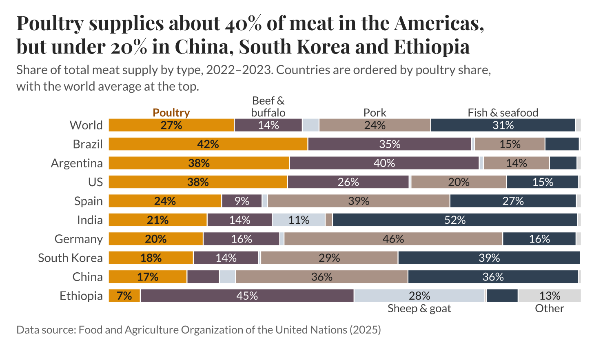

# Module 7: Make it Multivariate!

*Published 2 October 2026*

## Original Visusalisation

Global Carbon Budget. (2025, November 13). Annual CO₂ emissions [Data set]. Our World in Data. https://ourworldindata.org/grapher/annual-co2-emissions-per-country

## 1. Finding original visualisation
For this exercise, I chose the source from Our World in Data Visualisation showing annual CO2 emissions from fossil fuels in selected countries as my inspiration and starting point.  

## 2. Deciding on another multivariate to include

Upon deciding on another variate to add, I identified population size as a meaning additional variable because absolute Co2 emissions can look quite different when considered alongside the size of the population producing them. I sourced the population data from the World Bank and incorporated it into the visualisation using bubbles at ten-year intervals. The size of each bubble represents the country’s population at the point in time, allowing the reader to see changes in both emissions and population at the lines progress over time.  

I chose bubble size because it allowed me to add the population variable without substantially changing the original visualisation or making the time trends harder to follow. I chose the ten-year intervals rather than adding a bubble for every year, as this would have made the chart much more cluttered. The resulting visualisation works particularly well for the larger countries, such as China, India and the United States, where the bubbles clearly show the scale of their populations alongside their emissions. However, I found that the smaller countries become more difficult to distinguish because their population bubbles are much smaller and several lines overlap near the bottom of the chart. This is an important limitation of the approach, but I decided that preserving the overall comparison was more useful than increasing the bubble sizes artificially and potentially misrepresenting the population differences. 

## Reconstructing the data visualisation with improvements made
 

## Reflection

Overall, this exercise showed me how an additional variable can change the way an existing visualisation is interpreted. The original chart focuses primarily on how CO₂ emissions have changed over time and how countries compare with one another, while adding population provides another layer of context about the scale of each country's population. I also learned that adding a variable is not simply about finding another dataset and putting it onto a chart; I needed to consider how the new variable could be encoded in a way that remained understandable and did not overwhelm the original message.  
