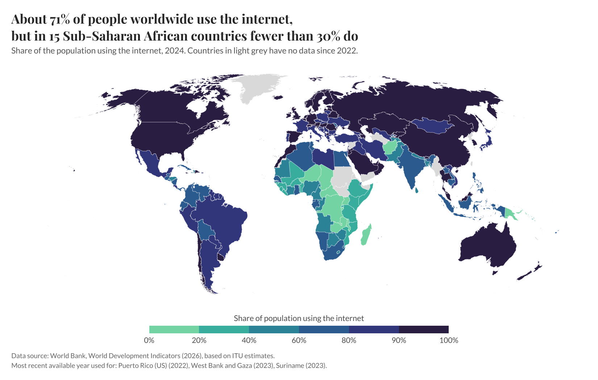

# Module 8: Map it!

*Published 2 October 2026*

## 1. Finding spatia data idea
When it comes to choosing interesting spatia, I bounced around many ideas, I was first thinking of working within Australia and its regional areas, but I couldn’t really find anything that piqued my interests. I then started to think outwards, I was close to deciding on America cause its many states have big populations and plenty of data available but I struggled to find a topic. I then decided on internet usage as my topic but doing the US wouldn’t be that interesting as most states have very high % of internet usage, so I branched outwards further and choose to do the entire world population. I then gathered my data from World Data Bank, where I used their CSV file to create the spatia data in R studios.  

## 2. Deciding on visualisation approach

For the visualisation itself, I chose a choropleth map, where each country is coloured according to the percentage of its population using the internet. I first reshaped the World Bank Data so that each country had a separate value for each year, then used the rnaturalearth package to obtain the geographical boundaries for each country. I joined the two datasets using country codes so that the internet usage data could be displayed directly on the map. Rather than simply using the latest year available, I checked the data coverage across different years and selected the most recent year where at least 80% of countries had data. For countries that were missing that particular year, I allowed their most recent value from within the previous two years to be used. I felt this was a reasonable compromise because it gave me much better global coverage without using values that were too old to make a fair comparison. 

## Chorepleth map of % of population using the internet worldwide
 

For the final design, I used a binned sequential colour scale so that countries could be grouped into clear ranges of internet usage rather than relying on a difficult-to-read continuous gradient. I used the viridis palette because it provides good colour accessibility and maintains differences between shades when viewed by people with colour-vision deficiencies. Countries without recent data were shown in light grey so they could be distinguished from countries with low internet usage. I also used a Robinson projection to make the world map look less distorted, added a descriptive title and subtitle to communicate the main pattern, and generated alt text directly from the data so that the accessibility description would remain consistent with the map.  

## Reflection

Overall, this exercise helped me understand that creating a spatial visualisation is not just about putting data onto a map. I had to think about which geographic level was appropriate, how missing or inconsistent data should be handled, and how colour, projection and labelling could make the final map easier to interpret. 
